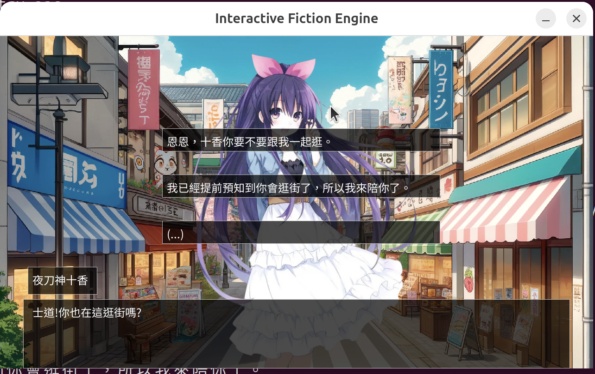

# 遊戲專案 - 程式設計二

本專案為學校課程「程式設計二」中，由三人共同完成的遊戲專案，旨在學習與應用 C 語言及圖形化界面開發技術，並強化團隊合作與專案管理能力。

---

## 🌟 學習到的內容
- **Git 指令操作與專案協作**：三人協作開發專案，使用 Git 進行版本控制。
- **C 語言的進階語法應用**：透過專案實踐，熟悉 C 語言的各種語法功能。
- **圖形化界面開發**：使用 SDL（Simple DirectMedia Layer）實現遊戲的圖形化界面。

---

## 🛠️ 專案功能

### 劇本檔功能
- 支援場景、人物、物品三種實體。
- 支援場景背景、人物頭像、人物立繪、物品圖標等圖片素材。
- 支援對話選項與多支線劇情設定，玩家可透過選擇物品或對話改變結局。

### 遊戲引擎功能
- 完整實現劇本檔中設計的內容。
- 支援場景背景與人物頭像的疊加顯示。
- 玩家角色設置，包含物品背包功能。
- 確保介面排版整齊，避免文字亂換行或 UI 元件凸出問題。
- 支援角色個人心情數值設置，可為單一好感度或多個不同面向的數值。

### 範例遊戲內容
- **角色數量**：至少 3 名角色。
- **場景數量**：至少 3 個場景。
- **物品數量**：至少 2 種物品。
- **結局數量**：至少 3 種結局。

---
🎮 《約會大作戰：戀愛選擇》 💕

這是一款根據 《約會大作戰》 製作的簡單互動式約會遊戲！玩家將扮演主角，透過選擇不同的對話選項，與女角們展開約會。每個選擇都會影響角色的反應，最終導向不同的結局。

🔹 簡單的選擇玩法 – 輕鬆體驗約會過程
🔹 不同反應與結局 – 嘗試解鎖各種發展
🔹 原作風格改編 – 讓粉絲感受熟悉的氛圍

輕鬆體驗約會的樂趣，你的選擇會帶來怎樣的結局呢？💖
---

## 🎮 遊戲遊玩畫面展示



---

## 🤝 開發團隊
- 成員 王翊鑫：主要負責遊戲邏輯實現、遊戲渲染函示。
- 成員 林楷杰：劇本黨設計、遊戲介面排版、所有遊戲內圖片。
- 成員 李韋達：負責劇本檔設計與遊戲劇情顯示、遊戲進度儲存處理。
- 足以提及的是，有些地方的小問題，我們都會互相協助，處理掉 bug。

---

## 🔧 技術堆疊
- **語言**：C 語言
- **圖形化界面**：SDL（Simple DirectMedia Layer）
- **版本控制**：Git

---

## 📦 專案執行
### 安裝
請確認已安裝 SDL 並設定開發環境。
在 Ubuntu 系統環境下執行。
下載檔案後，進入資料夾，路徑下有 Makefile ，可以直接打上 `make run` 便可開始遊玩。

套件安裝：
```bash
sudo apt-get install libsdl2-dev
sudo apt install libsdl2-ttf-dev
sudo apt install libsdl2-mixer-dev
sudo apt install libsdl2-image-dev
